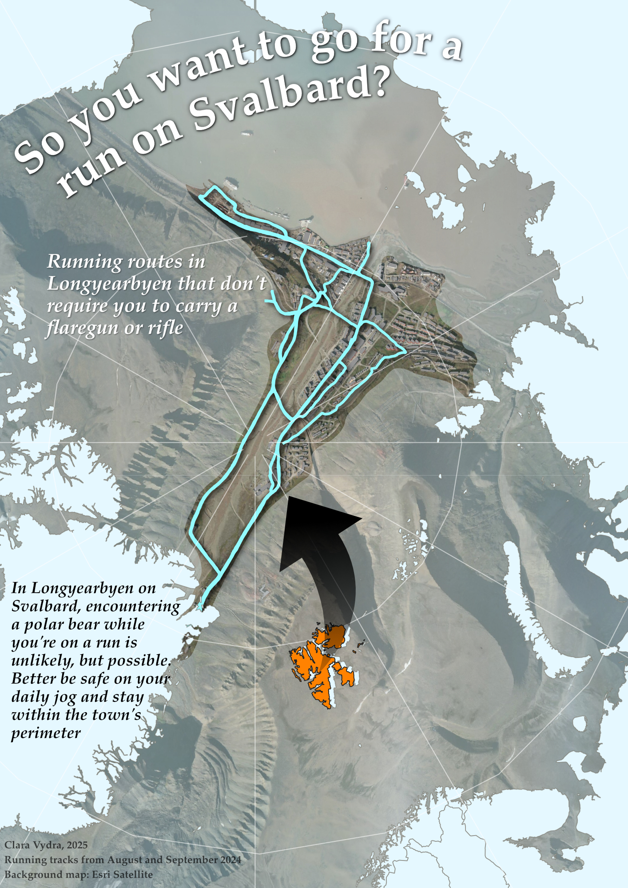
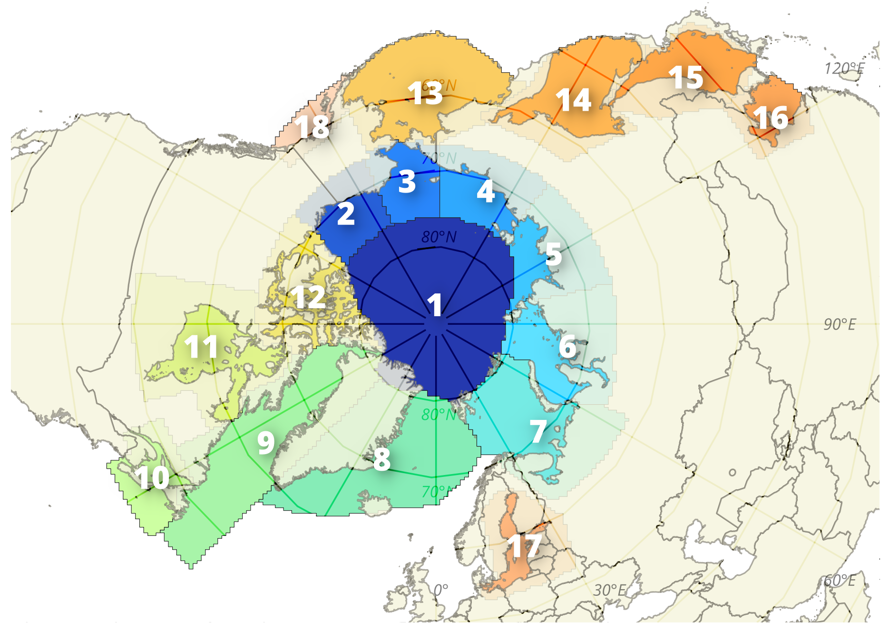

# About Me
MSc in Remote Sensing and Geoinformatics, Würzburg University

# Publication
Vydra, C., Dietz, A. J., Roessler, S., & Conrad, C. (2024). The Influence of Snow Cover Variability on the Runoff in Syr Darya Headwater Catchments between 2000 and 2022 Based on the Analysis of Remote Sensing Time Series. Water, 16(13), Article 13. [Link](https://doi.org/10.3390/w16131902)

# Gallery
Visualizations and maps I have created for university projects, internships or just for fun.

## Showcase maps
Experimenting with the Globe Builder Plugin in QGIS, I created this map showing the global rail network, with each railway connection as an individual vector line.

  

I created this map for day 3 of the 30 day map challenge, which was all about polygons. Had my first experiments using Affinity.

  

My first contribution to the 30 day map challenge: I wanted something fast and fun to look at.

  

A fun map on the (limited) running routes in Longyearbyen on Svalbard in the Arctic.

  

## Scientific maps
Different regions of the Arctic as defined by NSIDC-0780 SeaIceRegions EASE2-N25km. Made it for the final report and presentation of an internship at UiT Tromsø.

  

Two maps on a project classifying crop types in the US using VIS and SAR data.

  
  

  

For coursework on urban forms: An overview map showing different types of urban fabric in Chennai, India.

  
